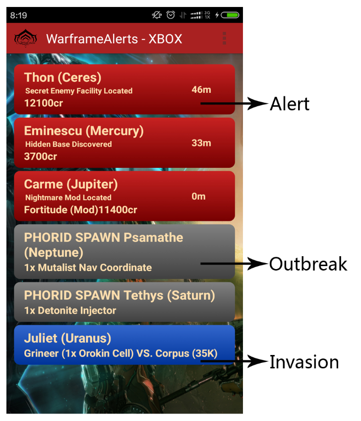

# WarframeAlerts
# warframe alerts on android phone

It loads warframe alerts information to your phone with three warframe platforms (PC, PS4, XBOX ONE).
In this app, i use simple UI to display warframe infomation: 
>>red items is alerts, 
>>blue items is invasions, 
>>grey items is outbreaks. 
  

This project uses Open source https://github.com/erikwt/PullToRefresh-ListView  
You can pull-down to refresh the alerts information. 

#Developed By
CheneyJin <cheneyjin@outlook.com>  
                                                                   
https://github.com/Cheney-Jin/WarframeAlerts
